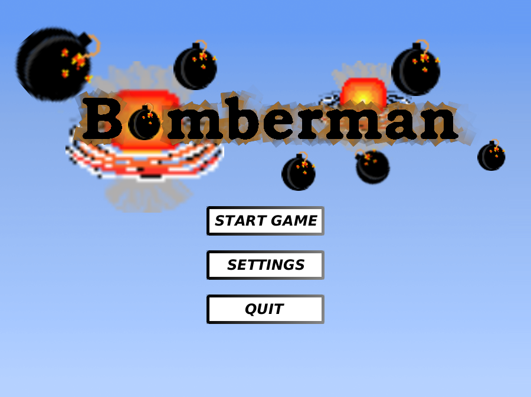
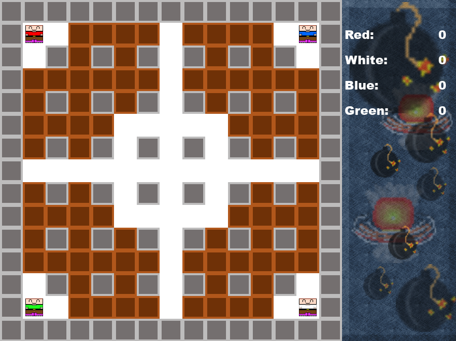

# Bomberman
A Bomberman clone me and some friends from uni made as part of a C++ project.
Supports up to 4 players on one computer. Supports both Windows and Linux.

## Features
* 2-4 players local battle
* 5 different level layouts
* 4 different themes
* Classic quake audio cues
* Configurable controls
* Configurable max fps (!)

## Authors
* Oskar Daniels
* Robin Carlsson
* David Enberg
* Simon André
* Johan Brandhorst

## Preview

